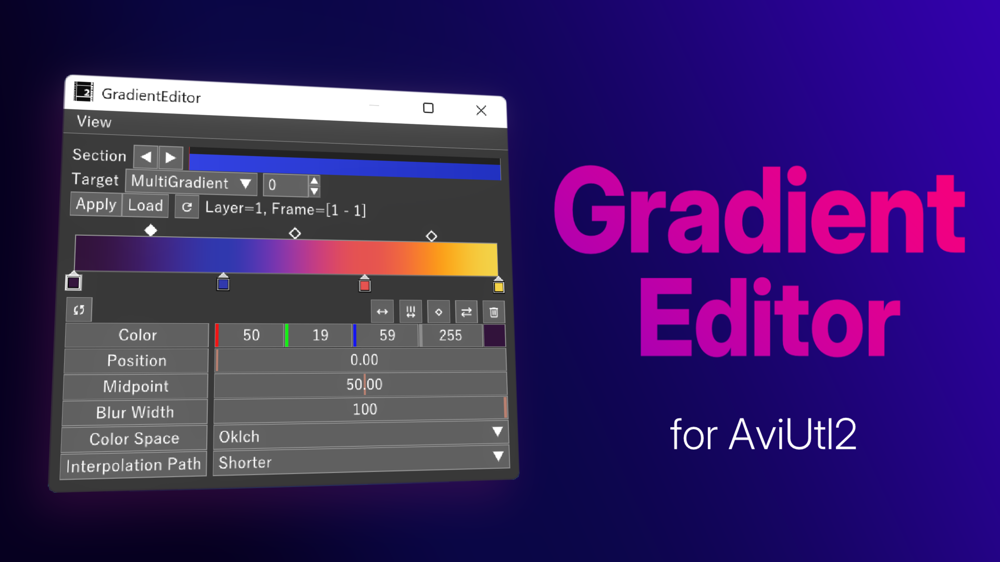
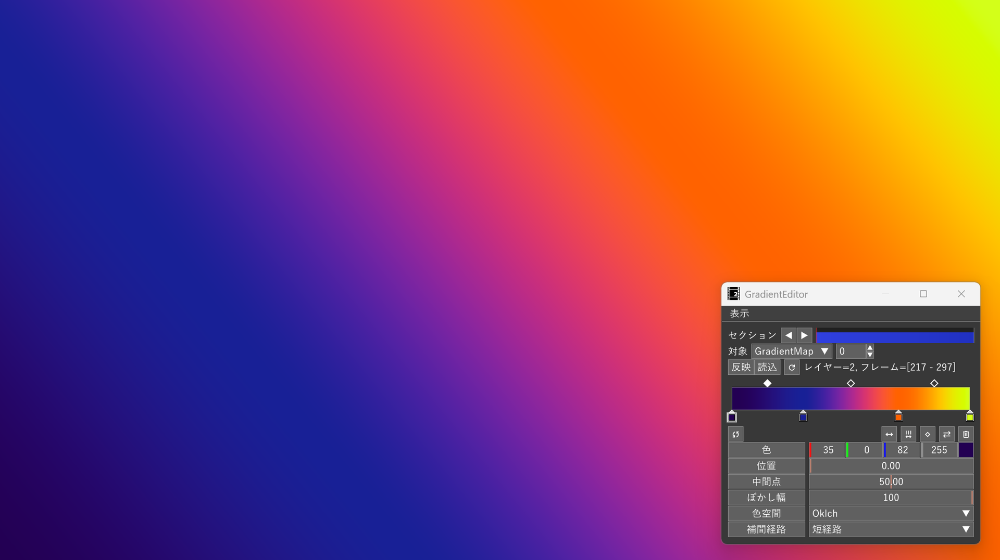
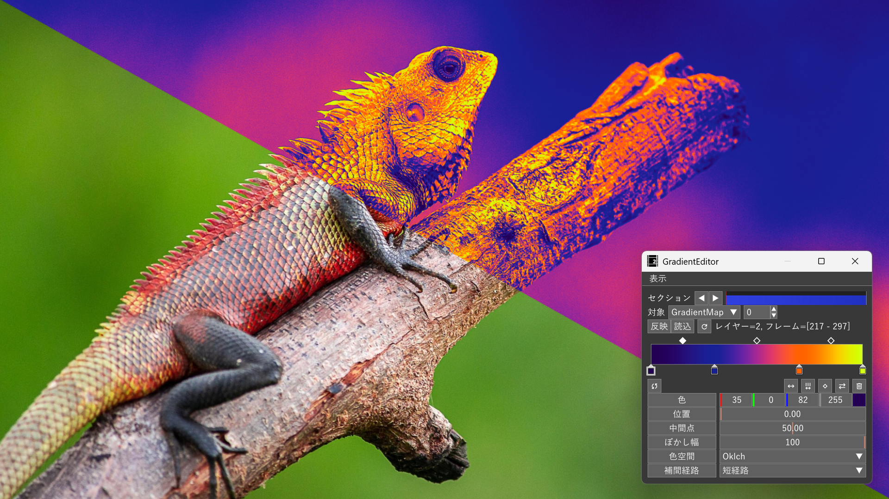
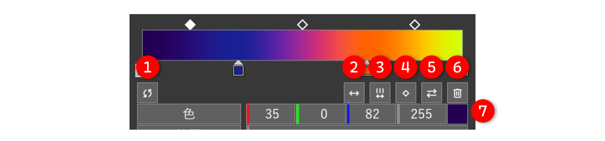
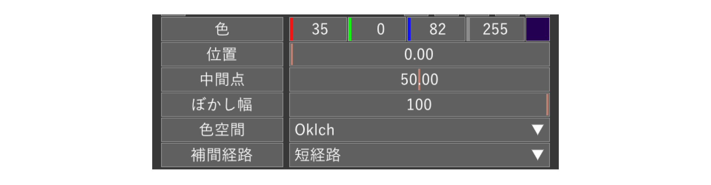

# AviUtl2 GradientEditor




[AviUtl2](https://spring-fragrance.mints.ne.jp/aviutl/) 用のグラデーションエディタです。付属する以下のエフェクトを編集することができます。

- 多色グラデーション（`MutliGradient@GradientEditor`）
- グラデーションマップ（`GradientMap@GradientEditor`）

## 動作環境

[AviUtl ExEdit2](https://spring-fragrance.mints.ne.jp/aviutl/)

- `beta32` 以降必須（`beta33` で動作確認済み）。

## 導入

[Releases](https://github.com/azurite581/AviUtl2-GradientEditor/releases) から `GradientEditor_v{version}.au2pkg.zip` をダウンロードし、AviUtl2 のプレビューにドラッグ&ドロップしてください。

以下のファイルがインストールされます。

| ファイル名 | 場所 | 説明 |
| :--- | :--- | :--- |
| `GradientEditor.aux2` | `Plugin` | グラデーションエディタ |
| `@GradientEditor.anm2` | `Script` | 多色グラデーション、グラデーションマップを含むスクリプト |
| `English.GradientEditor.aul2` | `Language` | 翻訳ファイル（英語） |

## 付属するスクリプト

本プラグインには以下のエフェクトを含むスクリプトが付属しています。

- 多色グラデーション（`MutliGradient@GradientEditor`）
- グラデーションマップ（`GradientMap@GradientEditor`）

グラデーションエディタ（`GradientEditor.aux2`）自体はこれら 2 つのエフェクトを直感的に操作するためのエディタに過ぎず、単体でグラデーション加工を施すことはできません。基本的には上記のエフェクトをオブジェクトに適用し、そのエフェクトのパラメータをグラデーションエディタ上で編集するという形になります。

>[!NOTE]
エフェクト単体でも使うことはできますが、グラデーションエディタ上で編集することを前提とした作りになっているため推奨しません。

### 多色グラデーション（`MutliGradient@GradientEditor`）



2色以上のグラデーションを作成するエフェクトです。デフォルトでは `色調整` カテゴリの中にあります。

#### パラメーター

- `強さ`  
グラデーションの適用度
- `中心X`、`中心Y`  
グラデーションの中心位置
- `角度`  
グラデーションの角度
- `幅`  
グラデーションの幅  
標準エフェクトのグラデーションとは異なり、`形状` が `線形` の場合、幅はオブジェクトサイズに合うように調整されません。本エフェクトにおいて、標準エフェクトのグラデーションの `線形` の `幅` に当たる項目は「`ぼかし幅`」になります。
- `形状`  
グラデーションマップの形状  
`線形`、`円形`、`短形`、`凸形`、`円形ループ`、`短形ループ`、`凸形ループ`から選択できます。
- `合成モード`  
グラデーションの合成モード
- `幅をオブジェクトに合わせる`  
`幅`がオブジェクトにフィットするように調整します（`幅` をオブジェクトの幅と同じサイズにします）。`形状` が `線形`、`凸形` の場合は回転も考慮します。ループ形状の場合は無効です。
- [`共通パラメーター`](#共通パラメーター)

### グラデーションマップ（`GradientMap@GradientEditor`）


Image by <a href="https://pixabay.com/users/pavanprasad_ind-22614562/?utm_source=link-attribution&utm_medium=referral&utm_campaign=image&utm_content=9076520">Pavan Prasad</a> from <a href="https://pixabay.com//?utm_source=link-attribution&utm_medium=referral&utm_campaign=image&utm_content=9076520">Pixabay</a>

グラデーションマップを適用するスクリプトです。デフォルトでは `色調整` カテゴリの中にあります。

#### パラメーター

- `強さ`  
グラデーションマップの適用度
- `ルーマ`  
[ルーマ](https://ja.wikipedia.org/wiki/%E3%83%AB%E3%83%BC%E3%83%9E)の係数   
`Rec. 601` と `Rec. 701` のどちらか指定できます。
- `合成モード`  
グラデーションの合成モード
- [`共通パラメーター`](#共通パラメーター)

### 共通パラメーター

次の項目はグラデーションエディタ側から編集することを想定しています。両方のスクリプトに存在する項目で、デフォルトでは折りたたまれています。

- `色1` ～ `色30`  
各マーカーの色
- `透明度1` ～ `透明度30`  
各マーカーの透明度
- `位置1` ～ `位置30`  
各マーカーの位置
- `中間点1` ～ `中間点29`  
各マーカー間の中間点の比率
- `ぼかし幅`  
グラデーションのぼかし幅
- `色空間`  
グラデーションの色空間
- `補間経路`  
`HSV`、`HSL`、`LCh`、`Oklch` といった色相を角度として表す色空間が、色相環上でどのような経路で補間するか指定します。
- `マーカー数`  
マーカーの数

## 使い方

### 基本設定


#### ① セクション

編集対象とするセクションを指定します。

#### ② 対象のエフェクト名

編集対象とするエフェクトを名前で指定します。

#### ③ 対象のエフェクトインデックス

② で指定したエフェクトが複数ある場合、どのエフェクトを編集対象とするかを番号（上から 0, 1, 2 ...）で指定します。

#### ④ 反映

グラデーションエディタの値をスクリプトに反映します。

#### ⑤ 読込

スクリプトの値をグラデーションエディタに読み込みます。

#### ⑥ 選択オブジェクトの再読み込み

選択しているオブジェクトを再読み込みします。

### 基本操作

#### 1. エフェクトの適用

`MutliGradient@GradientEditor`、 `GradientMap@GradientEditor`のどちらかをオブジェクトに適用します。

#### 2. グラデーションエディタ上で編集したいエフェクトの選択

1 で適用したエフェクトと同名のエフェクトを、グラデーションエディタの `対象` コンボボックスから選択します。

#### 3-A. グラデーションエディタの内容をスクリプトに反映する

オブジェクトを選択した状態でグラデーションエディタの `反映` ボタンを押すことで、スクリプト側に値が反映されます。  
`反映` ボタンが押されている状態であれば、エディタ上の変更が即座にスクリプトに反映されます。

#### 3-B. スクリプトの内容をグラデーションエディタに反映させる

`読込` ボタンを押すことでスクリプトの内容をグラデーションエディタに反映させることができます。`反映` ボタンとは違い、常にスクリプト側から値を取得することはできません。

#### 選択中のオブジェクトを変更した場合

グラデーションエディタの値をスクリプトに反映させる場合は、再度 `反映` ボタンを ON にするか、`反映` が ON の状態のまま選択オブジェクトの再読み込みボタンを押してください。  
スクリプトの値をグラデーションエディタ側に反映させる場合は、`読込` ボタンを押してください。

#### 同じエフェクトが 1 つのオブジェクトに複数適用されている場合

1 つのオブジェクトに同じエフェクトが複数ある場合、どのエフェクトを編集対象とするかを `対象` コンボボックスの右隣にあるコントロールにて、番号（上から 0, 1, 2 ...）で指定できます。  
例えば上から 2 番目のエフェクトにグラデーションエディタの値を反映させたい場合は 1 に設定します。

#### セクションの指定

グラデーションエディタで編集できるパラメータのうち、以下のものは移動方法を選択することアニメーションを付けることができます。

- `位置`
- `中間点`
- `透明度`
- `ぼかし幅`

移動後のパラメータをグラデーションエディタから編集したい場合は、セクションの線を移動後のセクションに合わせてください。  
中間点を追加した場合は、選択オブジェクトの再読み込みボタンを押すことでセクションの区切り線が出現します。

### マーカーの操作



#### マーカーの追加

グラデーションエディタの下部をクリックすると新たにマーカーを追加できます。最大で 30 個まで追加できます。

#### ① リセット

グラデーションをリセットして初期値に戻します。

#### ② マーカーを等間隔に配置

マーカーのみ等間隔に配置します。

#### ③ マーカーと中間点を等間隔に配置

マーカーと中間点を等間隔に配置します。

#### ④ すべての中間点を中央に再配置

すべての中間点を各区間の中央（`50`）に再配置します。

#### ⑤ マーカーを反転

マーカーの位置を左右反転します。

#### ⑥ マーカーの削除

削除したいマーカーを選択した状態で、ツールボタンの削除ボタンを押すと削除できます。マーカーが 2 つしかない場合は削除できません。

#### ⑦ マーカーの色の変更

マーカーをダブルクリックしてカラーエディタを表示するか、色を変更したいマーカーを選択した状態で、設定項目の `色` からカラーエディタを開くことで変更することができます。

### 設定項目



グラデーションの下にある設定項目から、各値を数値で指定することができます。
トラックバーに対しては `Ctrl + 左クリック` することで数値が入力できるようになります。

#### `色`

選択中のマーカーの色を変更します。数値の横の色付きのボタンを押すとカラーエディタが表示されます。  
数値上で右クリックすると、色の表示形式を変更できます。

#### `位置`

選択中のマーカーの位置を変更します。

#### `中間点`

選択中の中間点の比率を変更します。

#### `ぼかし幅`

グラデーションのぼかし幅を変更します。

#### `色空間`

グラデーションの色空間を指定できます。

#### `補間経路`

`HSV`、`HSL`、`LCh`、`Oklch` といった色相を角度として表す色空間が、色相環上でどのような経路で補間するか指定します。

### プリセットの使用

グラデーションエディタのメニューバーの `表示` メニューから `プリセット` を選択すると、プリセットウィンドウが表示されます（デフォルトで表示されています）。  
プリセットをクリックすると、グラデーションエディタ上のグラデーションがプリセットのものに置き換わります。

### プリセットの操作

#### 新規保存

現在のグラデーションをプリセットとして保存します。プリセットウィンドウの `新規保存` ボタンから保存できます。すでに同じ名前のプリセットが存在する場合は、末尾に `_copy` が付いた名前で保存されます。

プリセットは `Plugin/GradientEditorPreset` フォルダ下に `gradient_editor_preset.json` として保存されます。

#### 上書き保存

現在選択中のプリセットをグラデーションエディタのグラデーションで上書きします。

#### プリセットの入れ替え

プリセットをドラッグ&ドロップすることで順番を入れ替えることができます。

#### プリセットの削除

プリセット上で右クリックし、`削除` を押してください。

### その他

- ウィンドウの配置メニューはメニューバー上で右クリックすることで表示できます。

- 起動時にグラデーションエディタ上に表示されるグラデーションは、プリセットウィンドウ上で一番上にあるプリセットとなります。

- プリセットファイルを削除した場合、初期状態のプリセットファイルが自動的に生成されます。

## ビルド

### 環境

- **Windows OS**
- **CMake** 3.31 以上
- **MSVC**
- **Git**
- **[aulua](https://github.com/karoterra/aviutl2-aulua)**
- **[aviutl2-cli](https://github.com/sevenc-nanashi/aviutl2-cli)**

本リポジトリをクローン後、`aviutl2.tmol` と同じ階層で

```shell
au2 release
```

とすると、 `release` に `GradientEditor-v{version}.au2pkg.zip` が生成されます。

開発用にビルドする場合は

```shell
au2 prepare
au2 develop  # または au2 dev
```

とすることで開発用の AviUtl2 が `.aviutl2-cli/development` にダウンロードされ、その中に各ファイルが配置されます。

各コマンドの詳細については [aviutl2-cli](https://github.com/sevenc-nanashi/aviutl2-cli) を参照してください。

## ライセンス

[MIT License](LICENSE.txt) に基づくものとします。

## クレジット

### 使用したサードパーティライブラリ

[ThirdPartyNotices](ThirdPartyNotices.md) を参照してください。

### 使用したツール

### [aulua](https://github.com/karoterra/aviutl2-aulua)

<details>
<summary>MIT License</summary>

```text
MIT License

Copyright (c) 2025 karoterra

Permission is hereby granted, free of charge, to any person obtaining a copy
of this software and associated documentation files (the "Software"), to deal
in the Software without restriction, including without limitation the rights
to use, copy, modify, merge, publish, distribute, sublicense, and/or sell
copies of the Software, and to permit persons to whom the Software is
furnished to do so, subject to the following conditions:

The above copyright notice and this permission notice shall be included in all
copies or substantial portions of the Software.

THE SOFTWARE IS PROVIDED "AS IS", WITHOUT WARRANTY OF ANY KIND, EXPRESS OR
IMPLIED, INCLUDING BUT NOT LIMITED TO THE WARRANTIES OF MERCHANTABILITY,
FITNESS FOR A PARTICULAR PURPOSE AND NONINFRINGEMENT. IN NO EVENT SHALL THE
AUTHORS OR COPYRIGHT HOLDERS BE LIABLE FOR ANY CLAIM, DAMAGES OR OTHER
LIABILITY, WHETHER IN AN ACTION OF CONTRACT, TORT OR OTHERWISE, ARISING FROM,
OUT OF OR IN CONNECTION WITH THE SOFTWARE OR THE USE OR OTHER DEALINGS IN THE
SOFTWARE.
```

</details>

### [aviutl2-cli](https://github.com/sevenc-nanashi/aviutl2-cli)

<details>
<summary>MIT License</summary>

```text
MIT License

Copyright (c) 2026 Nanashi. <sevenc7c.com>

Permission is hereby granted, free of charge, to any person obtaining a copy
of this software and associated documentation files (the "Software"), to deal
in the Software without restriction, including without limitation the rights
to use, copy, modify, merge, publish, distribute, sublicense, and/or sell
copies of the Software, and to permit persons to whom the Software is
furnished to do so, subject to the following conditions:

The above copyright notice and this permission notice shall be included in all
copies or substantial portions of the Software.

THE SOFTWARE IS PROVIDED "AS IS", WITHOUT WARRANTY OF ANY KIND, EXPRESS OR
IMPLIED, INCLUDING BUT NOT LIMITED TO THE WARRANTIES OF MERCHANTABILITY,
FITNESS FOR A PARTICULAR PURPOSE AND NONINFRINGEMENT. IN NO EVENT SHALL THE
AUTHORS OR COPYRIGHT HOLDERS BE LIABLE FOR ANY CLAIM, DAMAGES OR OTHER
LIABILITY, WHETHER IN AN ACTION OF CONTRACT, TORT OR OTHERWISE, ARISING FROM,
OUT OF OR IN CONNECTION WITH THE SOFTWARE OR THE USE OR OTHER DEALINGS IN THE
SOFTWARE.
```

</details>

## 更新履歴

[CHANGELOG](CHANGELOG.md) を参照してください。
